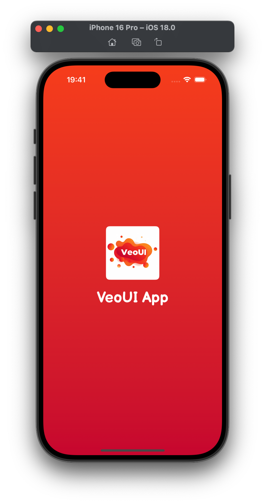
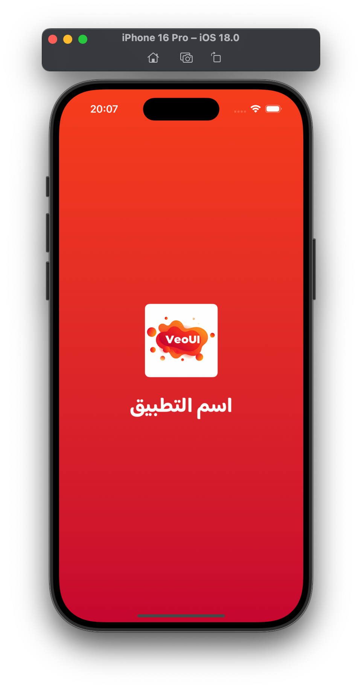
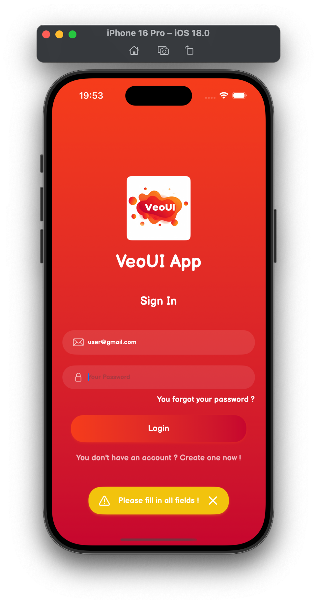

# VeoUI

> A comprehensive, customizable, and production-ready SwiftUI components library designed for building modern applications with ease


## Features

- 🎨 **40+ Pre-built Components**
- 📱 **Fully SwiftUI Native**
- 🔧 **Highly Customizable**
- ♿️ **Accessibility First**
- 🌍 **RTL Support**
- 📦 **Swift Package Manager**
- 🎯 **iOS 15+**

## Installation

### Swift Package Manager

Add VeoUI to your project through Xcode:

1. File > Add Package Dependencies...
2. Enter package URL: `https://github.com/VeoUI/VeoUISwift.git`
3. Select the version you want to use (Latest version is recommended)

Or add it to your `Package.swift`:

```swift
dependencies: [
    .package(url: "https://github.com/VeoUI/VeoUISwift.git", from: "0.9.1")
]
```

## Example App

Check out the [Example](Example) directory for a fully functional demo app showcasing all components and features.

## Configuration

Before using VeoUI Library components, you need to configure it with your custom settings:

```swift
import SwiftUI
import VeoUI

@main
struct VeoUIApp: App {

    init() {
    VeoUI.configure(
            primaryColor: Color(hex: "#e74c3c"),
            primaryDarkColor: Color(hex: "#c0392b"),
            infoColor: Color(hex: "#2ecc71"),
            warningColor: Color(hex: "#f1c40f"),
            dangerColor: Color(hex: "#e74c3c"),
            isRTL: true,
            mainFont: "Rubik-Bold")
    }

    var body: some Scene {
        WindowGroup {
            ContentView()
        }
    }
}
```

## Usage

### Basic Example

```swift
import SwiftUI
import VeoUI

struct ContentView: View {
    var body: some View {

    VeoButton(title: "Custom Gradient + Shape",
              shape: .rounded,
              elevation: 4,
              gradientColors: (Color(hex: "#16a085"), Color(hex: "#2ecc71")),
              action: {
                print("Button tapped")
              })
    }
}
```

## Components

### Screens

#### VeoSplash
<table>
<thead>
<tr>
<th colspan="2">Code</th>
</tr>
</thead>
<tr>
<td colspan="2">

```swift
import SwiftUI
import VeoUI

struct SplashView: View {
    @State private var isSplash = true

    var body: some View {
        if isSplash {
            VeoSplash(
     title: "VeoUI App",
     appLogo: "logo")
     .onAppear {
         DispatchQueue.main.asyncAfter(deadline: .now() + 2) {
             isSplash = false
         }
     }
        } else {
            OnboardingView()
        }
    }
}
```
</td>
</tr>
<tr>
<th>Screenshot (LTR)</th>
<th>Screenshot (RTL)</th>
</tr>
<tr>
<td>

</td>
<td>

</td>
</tr>
</table>

#### VeoLogin
<table>
<thead>
<tr>
<th colspan="2">Code</th>
</tr>
</thead>
<tr>
<td colspan="2">

```swift
VeoLogin(
     appName: "VeoUI App",
     appLogo: "logo",
     title: "Sign In",
     emailPlaceholder: "Your email",
     passwordPlaceholder: "Your Password",
     loginButtonTitle: "Login",
     forgotPasswordButtonTitle: "You forgot your password ?",
     dontHaveAccountButtonTitle: "You don't have an account ? Create one now !",
     showToast: true,
     pleaseFillInAllFieldsToastMessage: "Please fill in all fields !",
     onLoginTapped: { email, password in },
     onRegisterTapped: { },
     onForgotPasswordTapped: { },
     onLoginSuccess: { },
     onLoginError: { error in })
```
</td>
</tr>
<tr>
<th>Screenshot (LTR)</th>
<th>Screenshot (RTL)</th>
</tr>
<tr>
<td>

</td>
<td>

</td>
</tr>
</table>

### Data Display

#### VeoText

```swift
VeoText("Login", style: .subtitle, color: .white)
```

### Buttons

### VeoButton

```swift
VeoButton(title: "Rounded Button",
          style: .info,
          shape: .rounded,
          action: {
            print("Button tapped")
                })
```

## Contributing

1. Fork the repository
2. Create your feature branch (`git checkout -b feature/AmazingFeature`)
3. Commit your changes (`git commit -m 'Add some AmazingFeature'`)
4. Push to the branch (`git push origin feature/AmazingFeature`)
5. Open a Pull Request

## Support

For issues and feature requests, please file an issue on GitHub.

## License

This project is licensed under the Apache License 2.0 - see the [LICENSE](LICENSE) file for details.